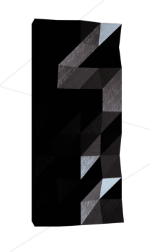

# Elementary algorithmic project
### lem-im

Staff pedago [pedago@42.fr](pedago@42.fr)

_Summary: This project is meant to make you code an ant farm manager_

---

# Contents

**[1. Forward](#forward)**<br>
**[2. Introduction](#introduction)**<br>
**[3. Objectives](#objectives)**<br>
**[4. General Instructions](#general-instructions)**<br>
**[4. Mandatory part](#mandatory-part)**<br>
**[4. Bonus part ](#bonus-part)**<br>
**[4. Submission and peer correction ](#submission-and-peer-correction)**<br>

---

# Chapter I

## Forward

Here is an extract of [Bill & John](http://billetjohn.free.fr/index_en.html)

*Up to mighty London<br>
Came an Irishman one day.<br>
As the streets are paved with gold<br>
Sure, everyone was gay,<br>
Singing songs of Piccadilly,<br>
Strand and Leicester Square,<br>
Till Paddy got excited,<br>
Then he shouted to them there:<br>
It’s a long way to Tipperary,<br>
It’s a long way to go.<br>
It’s a long way to Tipperary<br>
To the sweetest girl I know!<br>
Goodbye, Piccadilly,<br>
Farewell, Leicester Square!<br>
It’s a long long way to Tipperary,<br>
But my heart’s right there.<br>
(repeat)<br>
Paddy wrote a letter<br>
To his Irish Molly-O,<br>
Saying, "Should you not receive it,<br>
Write and let me know!"<br>
"If I make mistakes in spelling,<br>
Molly, dear," said he,<br>
"Remember, it’s the pen that’s bad,<br>
Don’t lay the blame on me!<br>
It’s a long way to Tipperary,<br>
It’s a long way to go.<br>
It’s a long way to Tipperary<br>
To the sweetest girl I know!<br>
Goodbye, Piccadilly,<br>
Farewell, Leicester Square!<br>
It’s a long long way to Tipperary,<br>
But my heart’s right there.<br>
Molly wrote a neat reply<br>
To Irish Paddy-O,<br>
Saying "Mike Maloney<br>
Wants to marry me, and so<br>
Leave the Strand and Piccadilly<br>
Or you’ll be to blame,<br>
For love has fairly drove me silly:<br>
Hoping you’re the same!"<br>
It’s a long way to Tipperary,<br>
It’s a long way to go.<br>
It’s a long way to Tipperary<br>
To the sweetest girl I know!<br>
Goodbye, Piccadilly,<br>
Farewell, Leicester Square!<br>
It’s a long long way to Tipperary,<br>
But my heart’s right there.<br>
This project is much easier if you do it while watching Bill & John.<br>*

---

# Chapter II

## Introduction

Some students of the School of Wizardry have created Hex, a thinking machine. It is
composed of ants for calculus, bee-hives and bees for memory and a mouse for (.. Huh,
right, what for already?) cheese (to feed the mouse) and a feather for writing.<br>
```
For more information, please refer to Terry Pratchett’s books, so
that you can switch your mind off 42. (**) Ook !
```
We are going to look in depth at its calculus bit. How does it work? Simple! We
make an ant farm, with tunnels and rooms; we place the ants on one side; and we look
at how they find the exit.<br>
How do we build an ant farm? We need tubes and rooms<br>
We join the rooms to one another with as many tubes as we need. A tube joins two
rooms to each other. No more than that. A room can be linked to an infinite number
of rooms and by as many tubes as deemed necessary. Then we must bury the ant farm
(wherever you want). This is extremely important to ensure that ants don’t cheat and
look at your design before before the game starts.<br>
Because arts and crafts with boxes, tape and ropes are not our greatest strength, we will
create a digital version instead.<br>
The goal of this project is to create an “Hex” simulator.<br>

---

# Chapter III

## Objectives

* Your program will receive the data describing the ant farm from the standard output
in the following format:<br>
```
number_of_ants
the_rooms
the_links
```
* The ant farm is defined by the following links:<br>
```
##start
1 23 3
2 16 7
#comment
3 16 3
4 16 5
5 9 3
6 1 5
7 4 8
##end
0 9 5
0-4
0-6
1-3
4-3
5-2
3-5
#another comment
4-2
2-1
7-6
7-2
7-4
6-5
#another comment
```
* Which corresponds to the following representation:
```

         ---------------
        /               \
  -----[5]----[3]----[1] |
 /              |     /  |
[6]-----[0]----[4]   /   |
\   -----------/ |  /    |
 \ /            [2]/----/
 [7]------------/

```
* There are two parts:<br>
    * The rooms, which are defined by: name coord_x coord_y<br>
    * The links, which are defined by: name1-name2<br>
    * All of it is broken by comments, which start with #<br>
```diff
- The rooms’ names won’t necessarily be numbers, and they won’t
- necessarily be in the right and continuous order (we will find rooms
- with names such as zdfg, qwerty, etc...) But most importantly, a
- room will never start with the character L nor the character #
```

```diff
- The rooms’ coordinates will always be integers.
```

* Lines that start with ## are commands modifying the properties of the line that
comes right after. <br>
* For example, ##start signals the ant farm’s entrance and ##end its exit. <br>

```diff
- Any unknown command will be ignored.
```
* Any non compliant or empty lines will automatically stop the ant farm’s reading
as well as the orderly processing of the acquired data. <br>
* If there isn’t enough data to process normally you must display **ERROR** <br>

---

# Chapter IV

## General Instructions

* This project will only be corrected by actual human beings. You are therefore free
to organize and name your files as you wish, although you need to respect some
requirements listed below.
* The executable file must be named **lem-in**.
* You must submit a Makefile. That Makefile needs to compile the project and
must contain the usual rules. It can only recompile the program if necessary.
* If you are clever, you will use your library for your lem-in. Also submit your folder
libft including its own Makefile at the root of your repository. Your Makefile
will have to compile the library, and then compile your project.
* Your project must be written in C in accordance with the Norm.
* You have to handle errors in a sensitive manner. In no way can your program quit
in an unexpected manner (Segmentation fault, bus error, double free, etc).
* Your program cannot have memory leaks.
* You’ll have to submit at the root of your folder, a file called author containing your
two usernames followed by a ’\n’
```
$>cat -e author
xlogin$
```
* Within your mandatory part you are allowed to use the following functions:
    * malloc
    * free
    * read
    * write
    * strerror
    * perror
    * exit
* You are allowed to use other functions to carry out the bonus part as long as their
use is justified during your defence.
* You can ask questions on the forum & Slack.

---

# Chapter V

## Mandatory Part

* The goal of this project is to find the quickest way to get n ants across the farm.
* Quickest way means the solution with the least number of lines, respecting the
output format requested below.
* Obviously, there are some basic constraints. To be the first to arrive, ants will need
to take the shortest path (and that isn’t necessarily the simplest). They will also
need to avoid traffic jams as well as walking all over their fellow ants.
* At the beginning of the game, all the ants are in the room ##start. The goal is
to bring them to the room ##end with as few turns as possible. Each room can
only contain one ant at a time. (except at ##start and ##end which can contain
as many ants as necessary.)
* We consider that all the ants are in the room ##start at the beginning of the game.
* At each turn you will only display the ants that moved.
* At each turn you can i each ant only once and through a tube (the room at
the receiving end must be empty).
* You must to display your results on the standard output in the following format:
```text
number_of_ants
the_rooms
the_links
Lx-y Lz-w Lr-o ...
```
x, z, r represents the ants’ numbers (going from 1 to number_of_ants) and y,
w, o represents the rooms’ names.
* Example 1 :
```text
[0]-[2]-[3]-[1]
```
```
zaz@blackjack /tmp/lem-in $ ./lem-in < subject.map
3
##start
0 1 0
##end
1 5 0
2 9 0
3 13 0
0-2
2-3
3-1
L1-2
L1-3 L2-2
L1-1 L2-3 L3-2
L2-1 L3-3
L3-1
zaz@blackjack /tmp/lem-in $
```
* Example 2.1 :
```
    [0]
   /   \
[1]    [2]
 |      |
 |     [3]
  \    /
    [4]
```
```
fbouquet@thepathfinder /tmp/lem-in $ ./lem-in < subject2-1.map
2
1 0 2
##start
0 2 0
##end
4 2 6
2 4 2
3 4 4
0-1
0-2
2-3
3-4
4-1
L1-1
L1-4 L2-1
L2-4
fbouquet@thepathfinder /tmp/lem-in $
```
* In example 2.1, it is not required to use all paths, (you are free to do so as long as
the result does not have more lines, in some cases, however, it would be unwise to
do so) However, you MUST use several paths if this is necessary (see example 2.2).
* Example 2.2 :
```
fbouquet@thepathfinder /tmp/lem-in $ ./lem-in < subject2-2.map
3
1 0 2
##start
0 2 0
##end
4 2 6
2 4 2
3 4 4
0-1
0-2
2-3
3-4
4-1
L1-1 L2-2
L1-4 L3-1 L2-3
L3-4 L2-4
fbouquet@thepathfinder /tmp/lem-in $
```
* Finally, we ask that your algorithm be able to use the best combination of paths
according to the number of ants in cases such as the one presented below.
* Example 3 :
```
   [start]
   /   |
 [3]  [1]--[5]
 /    |    |
[4]--[2] [6]
      |  /
     [end]
```
```
fbouquet@thepathfinder /tmp/lem-in $ cat subject3.map
4
3 2 2
##start
start 4 0
##end
end 4 6
4 0 4
1 4 2
2 4 4
5 8 2
6 8 4
start-1
3-4
2-4
1-5
6-5
end-6
1-2
2-end
3-start
fbouquet@thepathfinder /tmp/lem-in $
```
```diff
- This is not as simple as it seems
```
* Of course, your algorithm must render within a reasonable time, even in a case with
4000 rooms. 2 or 3 seconds is great, 9 seconds is mediocre, 15 seconds is too much.
```diff
- These are maps with sometimes more than 10,000 lines, the way you
- read and write data must also be fairly fast.
```
* Now, it would have been interesting to find out more about the type of operations
those students of the School of Wizardry could conduct with such a computer. All
that we know is that electricity is way more reliable today

---

# Chapter VI

## Bonus part

We will look at your bonuses if and only if your mandatory part is EXCELLENT. This
means that your must complete the mandatory part, beginning to end, your algorithm is
effective in solving the subject’s challenge, and your error management must be flawless,
even in cases of twisted or bad usage. If that’s not the case, your bonuses will be totally
IGNORED. <br>
Find below a few ideas of interesting bonuses you could create. Some could even
be useful. You can, of course, invent your own, which will then be evaluated by your
correctors according to their own taste.<br>
* As a bonus, why not code an ant farm vizualizer?
    * Either in 2 dimensions, seen from the ”top“. Or even better from the perspective of an ant in the corridors of the farm in 3D.
    * To use it, we could write: ./lem-in < ant_farm_map.txt | ./visu-hex
    * Please note that because the commands and comments also appear on the
standard output, it is possible to pass specific commands to the visualizer
(such as various colors or levels)
    * You should have noticed that the room’s coordinates will only be useful here.
    
---

# Chapter VII

## Submission and peer correction

Submit your work on your GiT repository as usual. Only the work on your repository
will be graded. <br>
Good luck to all! And remember to push your author file! <br>

